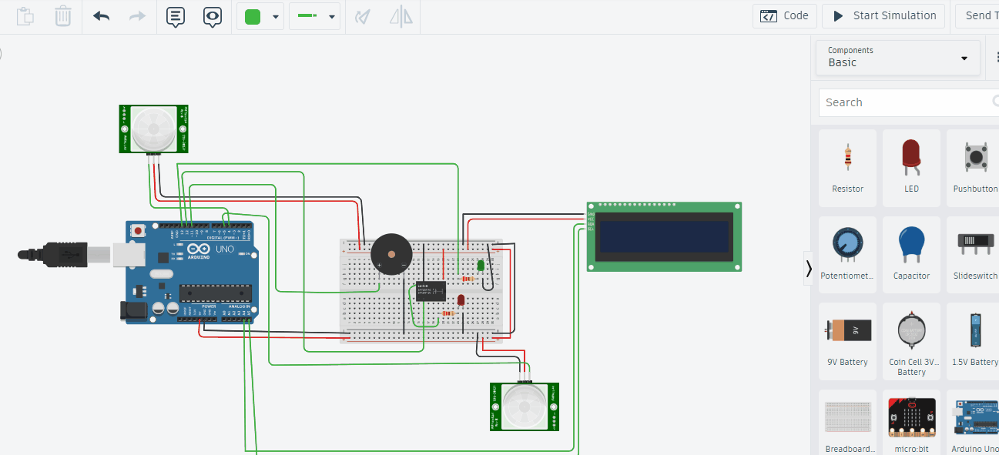

# Embedded Multiple Spatial Zone Automation Matrix (EMSZAM)

An energy-efficient, responsive smart-space automation system designed to eliminate static-occupancy blind spots. EMSZAM utilizes a distributed multi-zone Passive Infrared (PIR) sensor network managed by a non-blocking real-time logic controller on an 8-bit ATmega328P microcontroller (Arduino Uno).

---

## 📌 Project Overview

Traditional automated power management frameworks heavily rely on localized, single-point sensing methods. These systems suffer from severe spatial blind spots, causing premature appliance deactivation when occupants are relatively static. 

**EMSZAM** solves this by implementing a parallel sensory topology across multiple spatial zones. It processes concurrent digital inputs in real-time and manages high-current AC/DC appliance loads via isolated relay channels. To maintain system responsiveness, the firmware is entirely written using a **non-blocking asynchronous timing loop** instead of blocking hardware delays.

---

## ⚡ Key Features

* **Distributed Spatial Detection:** Supports multi-zone coverage (Zone A and Zone B) to dynamically monitor complex room layouts.
* **Non-Blocking Finite State Machine:** Written entirely using `millis()` timing routines to ensure the microcontroller remains continuously responsive to sensor changes.
* **Power-Isolation Switching:** Integrates a 1-channel electromagnetic relay to safely isolate and control high-current mains appliances.
* **I2C Status Terminal:** Features a 16x2 I2C Liquid Crystal Display (LCD) to show real-time environmental occupancy states without exhausting valuable microcontroller I/O pins.
* **Audio Warning Array:** Features a piezo buzzer feedback system for real-time status transitions.

---

## 🛠️ Hardware Architecture & Bill of Materials (BOM)

| Component | Description | Quantity |
| :--- | :--- | :--- |
| **Arduino Uno R3** | 8-bit RISC Microcontroller (ATmega328P) | 1 |
| **PIR Sensors** | Pyroelectric Infrared Motion Transducers | 2 |
| **16x2 LCD with I2C Module** | Liquid Crystal Display (SDA/SCL) | 1 |
| **5V Single-Channel Relay** | Electromagnetic load isolation switch | 1 |
| **Piezo Buzzer** | Audio indicator for state changes | 1 |
| **Red LED + $220\Omega$ Resistor** | Appliance A (Mock Load) | 1 |
| **Green LED + $220\Omega$ Resistor** | Appliance B status indicator | 1 |
| **Breadboard & Jumper Wires** | Prototyping connections | 1 |

---

## 🔌 Pin Mapping Diagram

| Microcontroller Pin (Arduino Uno) | Connected Device / Module | Signal Type | Description |
| :---: | :--- | :---: | :--- |
| **Pin 4** | PIR Sensor (Zone A) | Digital Input | Capture motion in Spatial Zone A |
| **Pin 5** | PIR Sensor (Zone B) | Digital Input | Capture motion in Spatial Zone B |
| **Pin 6** | Piezo Buzzer | Digital Output | State transition audio feedback |
| **Pin 12** | 1-Channel Relay Input | Digital Output | Actuates high-power Appliance B |
| **Pin 13** | Red LED (Appliance A) | Digital Output | Mock Load A control |
| **Pin A4** | LCD SDA Pin | $I^2C$ Data Bus | Serial Data Line |
| **Pin A5** | LCD SCL Pin | $I^2C$ Clock Bus | Serial Clock Line |

---

## ⚙️ Algorithmic Control Logic

Instead of using the blocking `delay()` function (which freezes the processor and ignores sensor inputs), EMSZAM utilizes an internal reference timestamp (`lastMotionTime`) updated continuously via `millis()`.

1. **Continuous Scan:** The controller reads the state of PIR_A and PIR_B every $100\text{ ms}$.
2. **Instant Trigger:** If motion is detected in *either* zone, the appliances instantly turn ON, the buzzer chirps, and the internal timestamp is updated:
   $$\text{lastMotionTime} = \text{millis()}$$
3. **Grace Period Verification:** If motion ceases, the controller continuously evaluates:
   $$\text{Current Time} - \text{lastMotionTime} \ge 5000\text{ ms}$$
4. **Automated Shutdown:** If the difference exceeds the predefined vacancy threshold ($5000\text{ ms}$) without any intermediate motion interrupts, the relay and loads are cut off safely, transitioning the system state to `VACANT`.

---

## 🗺️ Circuit Diagram
Below is the complete physical breadboard layout and signal routing diagram mapped out via Fritzing. This diagram matches the pin definitions outlined in the architecture tables above.

---

## 📺 Live Demonstration Video

Click the preview window below to watch the EMSZAM system prototype operating in real-time on the testing bench, showing automated zone tracking, dynamic `millis()` grace-period countdowns, and load-switching execution:

> 💡 *Note: The video highlights the responsiveness of the non-blocking state machine when motion shifts asynchronously between Input Zone A and Input Zone B.*

---

